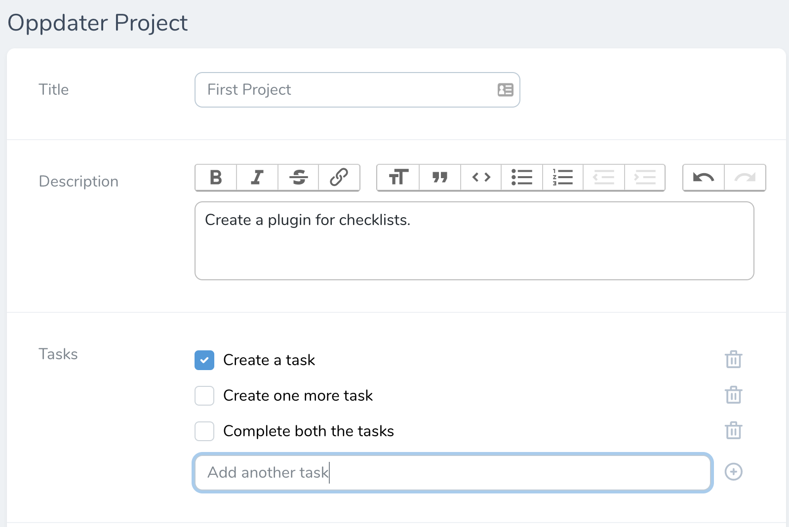
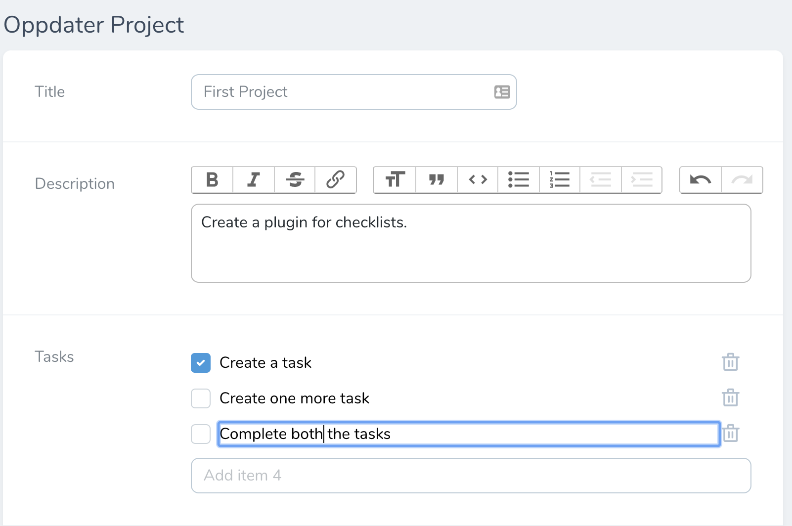
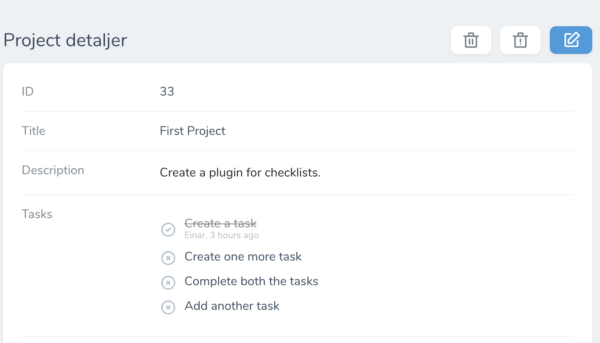
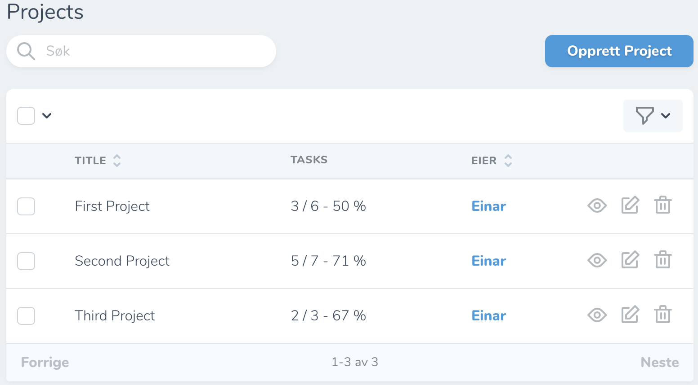

# Laravel Nova Checklist Field

[](https://packagist.org/packages/e2consult/novachecklists)
[](https://packagist.org/packages/e2consult/novachecklists)
[](https://packagist.org/packages/e2consult/novachecklists)

E2Consult is a webdevelopment team based in Oslo, Norway. You'll find more information about us [on our website](https://e2consult.no).

This package is made to allow you to easily create checklists in Laravel Nova. All you need is a text/json column on you model to store the items.

## Installation

You can install the package via composer:


```bash
composer require e2consult/novachecklists
```

## Usage


```php
use E2Consult\NovaChecklist\Checklist;

Checklist::make('Tasks')
    ->placeholder('Add another task')
    ->withPlaceholderCount()
    ->logUsers()
    ->showTimestamps()
    ->showItemStatusOnIndex()
    ->showCompletionOnIndex(),
```

To use this package you'll need a text or JSON column on you model to save the items/tasks, as they are persisted as json on your model.

### Form-page
The `->placeholder()` method allows you to specify your placeholder-text for the "add new item field".

The `->withPlaceholderCount()` method lets you show the item number when adding new item. If there is already 5 items, then it will say "Add item 6".

The `->logUsers()` method allows you to save which user created or completed the task/item. You specify which column on the User model you want to save on task, it default to use the "name" column.




You can edit an existing item by clicking on it.



### Detail-page

The `->showTimestamps()` method lets you show how long ago a task was completed.



### Index-page
By default this package will only show the task count on the index page.

The `->showItemStatusOnIndex()` will change the index to show how many tasks are completed of the total amount of tasks/items.

The `->showCompletionOnIndex()` method will let you show how many percent of the tasks are completed.



## License

The MIT License (MIT).
